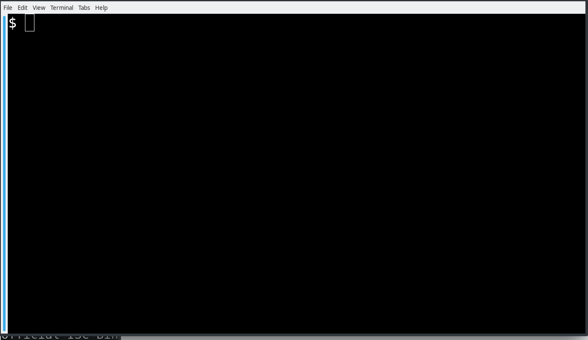

# vim-nftables

VIM Syntax for NFTABLES.

# ALPHA, it is in ALPHA stage #

This VIM syntax proactively highlights typo errors in RED for:

* nftables configuration file and 
* nftables script file

Files having `nft` in 1st-line shebang will activate the `syntax nftables`.
Files having `.nft` filetype also will active the `syntax nftables` as well.

Bug Reporting
-------------
If you have any issues with this syntax file, see if you can:

* keep narrowing down the offending line until it stopped offending, hopefully
  it is just to just one (or few) lines.  No need to expose your entire `nftables.nft`
  Don't forget to change all IP addresses (unless that breaks too) for
  your privacy sake.

* post/file the offending line over at my [Github issue](https://github.com/egberts/vim-nftables/issues). 

* detail the wrong highlight and state what you think is to be its
  correct highlight, if applicable.

* Use gist to hold snapshots

Debugging Vim Syntax
--------------------
If you are bold enough to try your hand on debugging Vim syntax file,
see my [DEBUG.md](https://github.com/egberts/vim-syntax-bind-named/blob/master/DEBUG.md) on how to debug a Vim syntax file.

Install
-------
See [INSTALL](https://github.com/egberts/vim-nftables/blob/master/INSTALL.md)
on how to install this Vim syntax to your local Vim settings.

To Vim Developers
-----------------
Note to Vim developers:  During the prototyping of my IPv6 address
syntax matching, I noticed that vim 8.1 can only support a maximum
of 9 groupings of parenthesis, even if I used the "\%( ... \)"
notation (instead of "\( ...\)").

As a result of this Vim limitation, I've had to
duplicate IPv6 match patterns through this syntax file to get around
this vim 8.1 limitation.  But it works and faster so.

